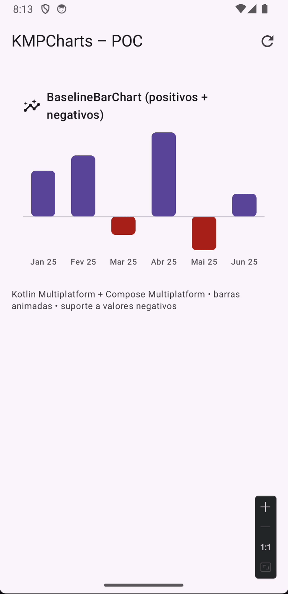
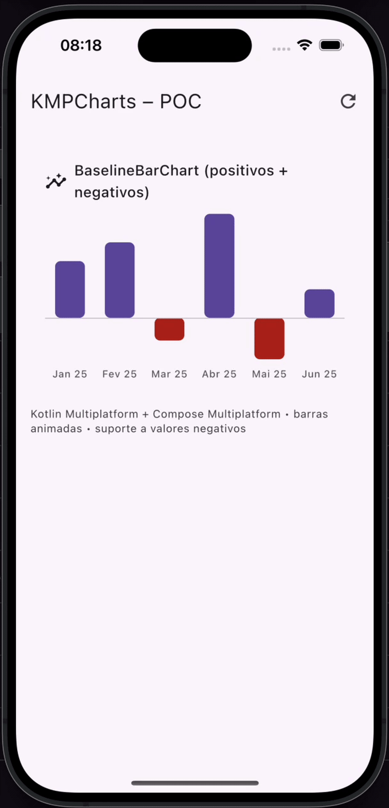
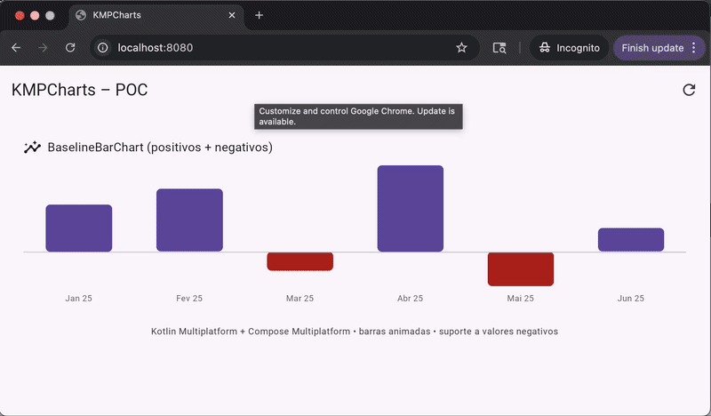
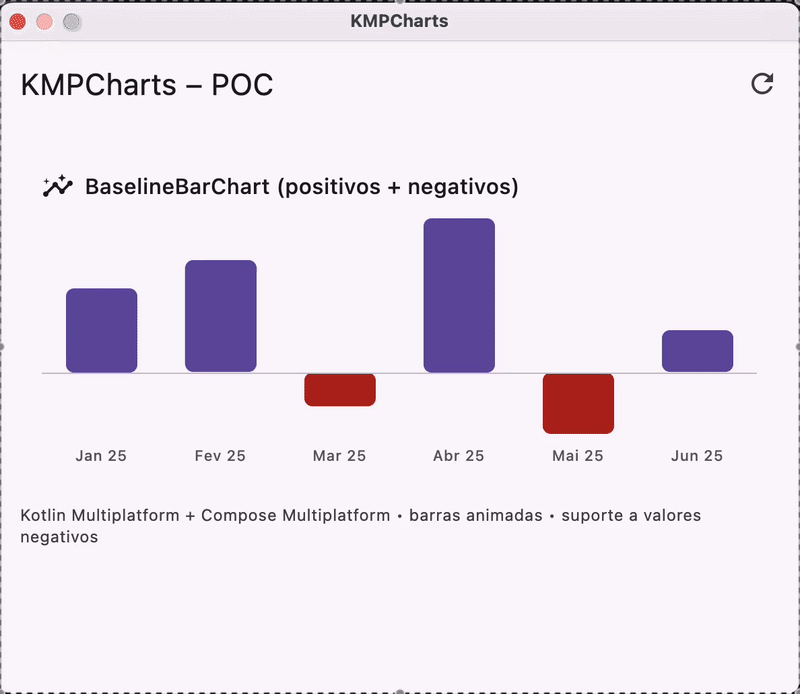
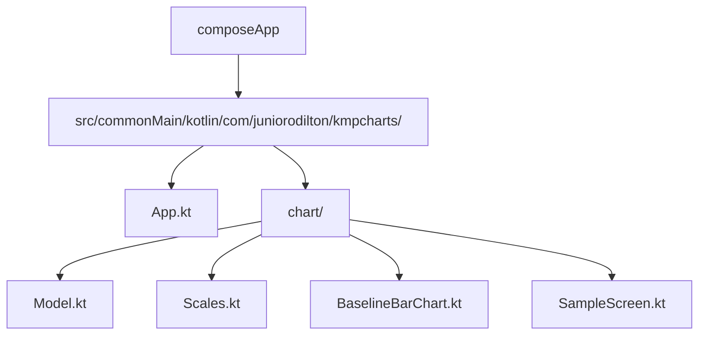

# KMPCharts – Baseline Bar Chart (POC)

**Kotlin Multiplatform + Compose Multiplatform** sample mostrando um **gráfico de barras com eixo zero dinâmico**, suportando **valores positivos e negativos**, sem libs externas.

[https://github.com/juniorodilton/KMPCharts](https://github.com/juniorodilton/KMPCharts)

## ✨ Destaques

* Compose Multiplataforma: Android • iOS • Desktop (JVM) • Web (WASM).
* Gráfico **animado** com `animateDpAsState`.
* **Eixo baseline** se ajusta ao dataset (todos ≥0, todos ≤0, ou misto).
* Sem dependências externas de chart — 100% Compose.

## 📽️ Demos (Android / iOS / Web / Desktop)

<p align="center">
  
  <br/>
  
  
</p>

## ⚙️ Rodando

### Android

* Abrir no Android Studio > `composeApp` > Run `androidApp`.

### iOS

* Abrir `iosApp/iosApp.xcodeproj` ou via Gradle task `composeApp:iosDeploy*` (requer Xcode).

### Desktop (JVM)

* Gradle: `./gradlew :composeApp:run`

### Web (WASM)

* Gradle: `./gradlew :composeApp:wasmJsBrowserRun`
* Abre o endereço indicado no terminal.

## 📁 Estrutura (POC)

### ASCII Tree

```
composeApp/
└─ src/commonMain/kotlin/com/juniorodilton/kmpcharts/
   ├─ App.kt
   └─ chart/
      ├─ Model.kt
      ├─ Scales.kt
      ├─ BaselineBarChart.kt
      └─ SampleScreen.kt
```

### Mermaid Diagram



## 🧠 Contexto

Na semana passada, um time interno pediu um gráfico de barras. Eu criei uma POC no mesmo dia; no fim, decidiram construir internamente. Resolvi **abrir a POC** para a comunidade como um exemplo simples e reutilizável.

## 🚀 Próximos passos

* Barras agrupadas e empilhadas.
* Linha/grade e etiquetas de valor.
* A11y/touch avançado e haptics.
* Extrair para um módulo `:charts` separado.

---

## English

This repo is a **Kotlin Multiplatform + Compose Multiplatform** sample implementing a **baseline bar chart** (supports **positive and negative values**) with **no external chart libs**.

### Why

I built this POC in a day for an internal request; later the team decided to do it in-house. Sharing the POC to help others and showcase a clean CMP approach.

### Highlights

* Android • iOS • Desktop • Web (WASM).
* Smooth height animation via `animateDpAsState`.
* Dynamic baseline (top/middle/bottom) based on data.

### How to run

* Android: run `androidApp` from Android Studio.
* iOS: open `iosApp` project or use Gradle iOS tasks.
* Desktop: `./gradlew :composeApp:run`
* Web: `./gradlew :composeApp:wasmJsBrowserRun`

### Next

* Grouped/stacked bars; grid & value labels; extract `:charts` module.
